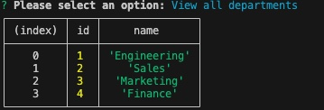
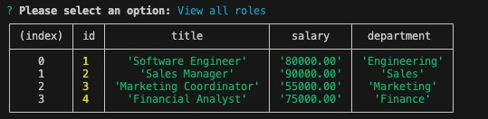
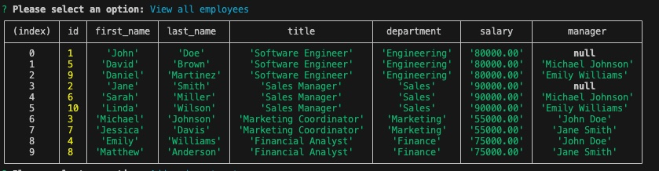

# Emplyeetracker

## Description 

Allows a business to track employees

## Instructions 

 <pre><code>npm i</code></pre> to install all the dependencis 
 
Run the following comands

<pre><code>source schema.sql </code></pre>
<pre><code>source seeds.sql </code></pre>

Then run

<pre><code>node index.js </code></pre> 

and follow instructions!

## Screenshots 

## Demo video link 

